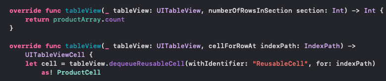
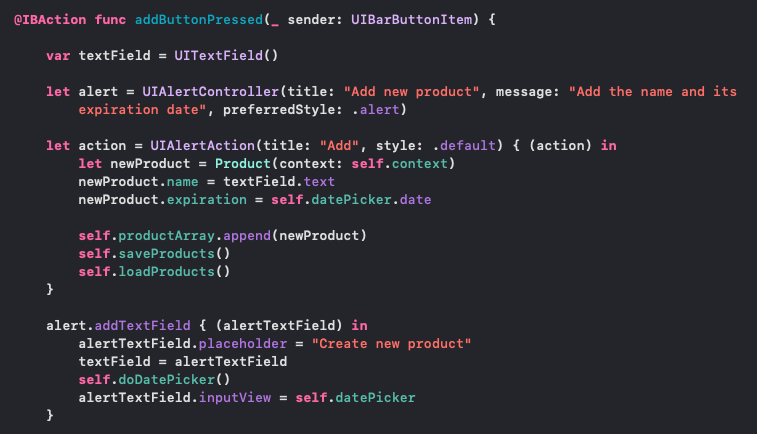
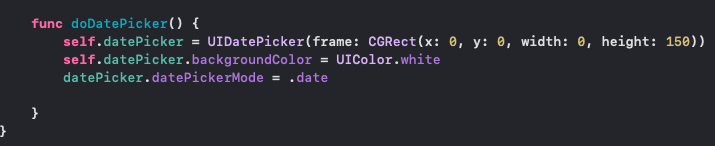
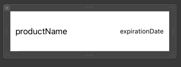
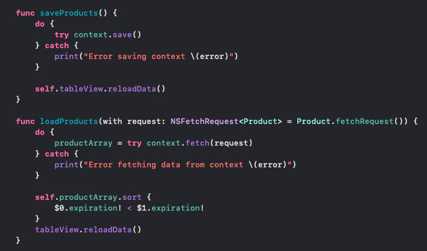
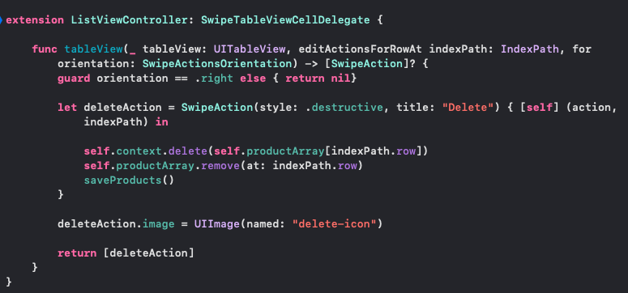
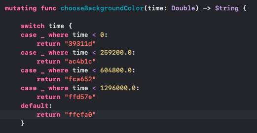

#  Novence

Using Core Data, I created this app that saves a list of user inputed products next to their respective expiration date.

## Steps to create the app

### Created numberOfRowsInSection and cellForRowAt functions.

Found in Controller/ListViewController

### Created an IBAction function so that the user can add new items to the list.

Found in Controller/ListViewController

### Created a doDatePicker function so that the user can choose the product's expiration date.

Found in Controller/ListViewController

### Created a xib file to store the custom Cell.

Found in View/ProductCell.xib

### Created functions to save and load the user inputed data from context.

Found in Controller/ListViewController

### Created a function to delete a cell by swiping the screen.

Found in Controller/ListViewController

### Made it so the cell changes color depending on how far away the expiration date is.

Found in Model/CellManager

